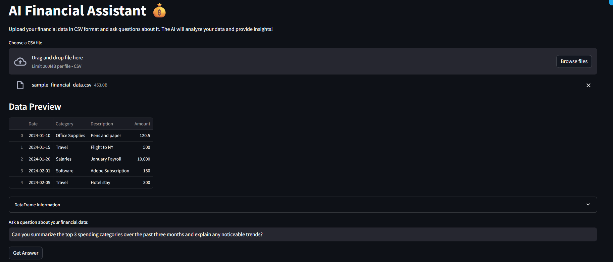

# AI Financial Assistant

A Streamlit-based web application that allows users to analyze financial data using natural language queries powered by Groq LLMs (e.g., compound-beta).

## Features

- Upload and analyze CSV files containing financial data
- Ask natural language questions about your data
- Get AI-powered insights and analysis
- Preview your data with interactive DataFrame display
- Download analysis results as text files

## Sample Screenshots

Below are some screenshots showcasing the working of the project:




## Setup

1. Clone this repository:
```bash
git clone <repository-url>
cd ai-financial-assistant
```

2. Create a virtual environment and activate it:
```bash
python -m venv venv
source venv/bin/activate  # On Windows: venv\Scripts\activate
```

3. Install the required packages:
```bash
pip install -r requirements.txt
```

4. Create a `.env` file in the project root and add your Groq API key:
```
API_URL=https://api.groq.com/openai/v1/chat/completions
MODEL=compound-beta
API_KEY=your_groq_api_key_here
```

## Usage

1. Start the Streamlit app:
```bash
streamlit run app/main.py
```

2. Open your web browser and navigate to the URL shown in the terminal (usually http://localhost:8501)

3. Upload your CSV file containing financial data

4. Ask questions about your data using natural language

## Example Questions

- "What were the top 5 expenses last month?"
- "Show me the trend in income over the past year"
- "What's the average transaction amount?"
- "Summarize the financial trends in this data"

## Requirements

- Python 3.8+
- Streamlit
- Pandas
- Python-dotenv
- Requests

## Note

Make sure your CSV file is properly formatted and contains relevant financial data. The application works best with structured financial data such as:
- Transaction records
- Income statements
- Expense reports
- Budget data

---

## Contributing

If you'd like to contribute or have questions, please contact me via GitHub issues or directly at [your-email@example.com]. 